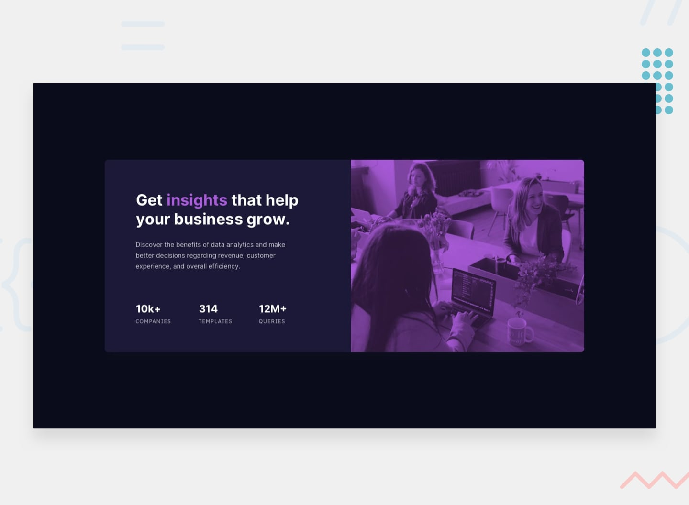

# Stats Preview Card — Lecture Notes & Exercises

Purpose: concise, usable lecture notes covering every HTML element, CSS variable, selector, pattern, and implementation tips used in this project, plus suggested practice projects.

---

**Files:**
- [index.html](index.html) — markup for the preview card
- [style.css](style.css) — styles, variables, layout, and responsive rules

---

**Quick Overview**
- This project builds a centered stats preview card: an image header, headline, description, three stats, and an attribution footer. It uses CSS custom properties, Flexbox, a mobile-first layout with a media query at 700px, and a pseudo-element overlay on the image.

## HTML: element-by-element
- `<!DOCTYPE html>`: declares HTML5, enabling modern parsing and CSS features.
- `html[lang="en"]`: language attribute helps accessibility and screen readers.
- `meta viewport`: responsive scaling for mobile devices.
- `link rel="stylesheet" href="./style.css"`: includes the stylesheet.
- `main.page`: semantic container; class `page` used to center content with Flexbox.
- `section.card`: the card component. Use `section` for a self-contained content block.
- `picture.card-image` with `source` + `img`: responsive images — `source` selects desktop image when `min-width:700px` matches; `img` provides fallback/mobile image and `alt` text (presently `alt="Decorative header"` — if purely decorative consider `alt=""` and `aria-hidden="true"`).
- `div.card-content`: wrapper for headline, paragraph, and stats list.
- `h1.class-title` and `span.accent`: headline with accent span to color a single word.
- `p` description: short paragraph text.
- `ul.stats > li.stat`: list of statistics, structured for readability and easy styling.
- `footer.attribution`: small footer with links to challenge and coder profile.

## CSS: variables and purpose
- `:root` defines reusable custom properties (CSS variables):
  - `--clr-bg` background color of page
  - `--clr-card` main card background
  - `--clr-accent` accent color for highlighted text and links
  - `--clr-mp` main paragraph color (with alpha)
  - `--clr-stat` color for stat labels
  - `--clr-cardimg` image overlay color for large screens
  - `--white` semantic white
  - `--fw-normal`, `--fw-bold` font weights
  - `--max-width` maximum card width (overwritten in media query)

Benefits: variables centralize theme values, enable easy theming (dark/light), and allow runtime changes via JavaScript or media queries.

## Key selectors & patterns
- Global reset: `* { box-sizing: border-box }` — prevents unexpected size calculations.
- `html, body { height: 100% }`: ensures full-height centering works consistently.
- `.page` centers content using Flexbox and provides vertical gap between elements.
- `.card` uses `max-width`, `border-radius`, `overflow: hidden`, and `box-shadow` to form the container.
- `.card-image::after` pseudo-element: positioned absolute with `inset:0` to cover the image and apply a translucent overlay color. `pointer-events:none` keeps clicks through to the image.
- Use of `.stats` as a horizontal Flexbox list; `.stat { flex:1 }` evenly distributes columns.
- `.stat-label { text-transform: uppercase; letter-spacing:1px }` — common UI pattern for small caps labels.

## Responsive behavior
- Mobile-first: base styles are for narrow viewports. At `@media (min-width:700px)`:
  - `:root { --max-width: 900px }` updates the variable.
  - `.card` switches to a two-column row layout with `flex-direction: row-reverse` to place the image on the left (desktop preview uses desktop image).
  - `.card-image img { object-fit: cover }` ensures the image fills its column.
  - `.card-content` gets larger padding for desktop.

## Accessibility notes
- Use meaningful `alt` text or empty `alt=""` for decorative images.
- Ensure link contrast meets WCAG (check `--clr-accent` vs background).
- Headings: only one `h1` per page or per major content region — here it's acceptable if the card is the main content.

## Implementation variations & extensions (how to implement elsewhere)
- The overlay: instead of a pseudo-element, use a separate absolutely positioned `
` inside `.card-image` if you need separate interactive overlays.
- Grid alternative: replace `.stats` Flexbox with CSS Grid to create responsive wrapping of stat items with `grid-template-columns: repeat(auto-fit, minmax(120px,1fr))`.
- Theme switching: toggle `data-theme` attribute on `html` and add `:root[data-theme="light"] { --clr-bg: ... }` to switch variables.
- Animations: add subtle `transform` or `opacity` transitions on `.card` hover or on stat numbers when they appear (use `@keyframes`).
- Utility classes: extract spacing, text-color, and layout utilities (e.g., `.u-mt-sm`, `.text-muted`) to reuse across components.

## Extra techniques not used here (and result differences)
- CSS custom properties with calc(): `width: calc(var(--max-width) - 48px)` — allows dynamic spacing.
- `clamp()` for fluid typography: `font-size: clamp(1rem, 2.5vw, 1.5rem)` to scale smoothly.
- CSS variables on pseudo-elements: remember they inherit from the element they’re attached to (useful for per-card colors).
- Logical properties: `margin-block`/`padding-inline` for better internationalization support.

## Quick troubleshooting tips
- Underline persists on links: check browser agent styles (`a { text-decoration: underline }`) — override with `.attribution a { text-decoration: none }` or more specific selectors.
- Variable not applying: ensure names match (`--max-width` vs `--maxwidth` — note the repo has `--max-width` and a typo `--maxwidth` used in `.card`), fix the inconsistency to avoid bugs.

## Suggested Projects (5–10) — end-of-day practice
1. Responsive Card Variations (1–2 hours)
   - Create three variations of this card: dark, light, and colorful. Use CSS variables to swap themes.
2. Fluid Typography & Layout (1–2 hours)
   - Convert fixed font sizes/paddings to use `clamp()` and `min()`/`max()` so the card scales smoothly across screens.
3. Stats Grid with Animations (1–2 hours)
   - Replace the `.stats` Flexbox with CSS Grid. Animate stat numbers counting up on scroll into view.
4. Accessible Image Variants (45–60 minutes)
   - Implement decorative vs informative image handling, add ARIA attributes and test with a screen reader.
5. Card Component Library (2–3 hours)
   - Extract this card into a reusable component (vanilla JS or framework of choice). Props: title, stats, images, theme.
6. Overlay Interactive Demo (1–2 hours)
   - Make the image overlay respond to mouse position (radial gradient) and on click reveal more details.
7. CSS-Only Theme Toggle (45–90 minutes)
   - Implement a CSS-only theme toggle (checkbox hack) that switches variables without JS.
8. Print-Friendly Variant (30–60 minutes)
   - Add `@media print` rules to produce a clean, printer-friendly version of the card.

Tips for practice: start mobile-first, make a small change and test, then iterate. Use version control commits after each milestone.

---

If you want, I can: open a PR with this README, run a quick lint, or implement one of the suggested projects — which would you prefer next?
# Frontend Mentor - Stats preview card component

## Welcome! 👋

Thanks for checking out this front-end coding challenge.

[Frontend Mentor](https://www.frontendmentor.io) challenges help you improve your coding skills by building realistic projects.

**To do this challenge, you need a basic understanding of HTML and CSS.**

## The challenge

Your challenge is to build out this card component and get it looking as close to the design as possible.

You can use any tools you like to help you complete the challenge. So if you've got something you'd like to practice, feel free to give it a go.

Your users should be able to:

- View the optimal layout depending on their device's screen size

### Want some support on the challenge? 

[Join our community](https://www.frontendmentor.io/community) and ask questions in the **#help** channel.

## Where to find everything

Your task is to build out the project to the designs inside the `/design` folder. You will find both a mobile and a desktop version of the design.

The designs are in JPG static format. Using JPGs will mean that you'll need to use your best judgment for styles such as `font-size`, `padding` and `margin`.

If you would like the Figma design file to inspect the design in more detail, you can [subscribe as a PRO member](https://www.frontendmentor.io/pro).

You will find all the required assets in the `/images` folder. The assets are already optimized.

There is also a `style-guide.md` file containing the information you'll need, such as color palette and fonts.

## Using AI coding assistants

We've included two files to help you if you're using AI coding assistants (like Claude, GitHub Copilot, Cursor, etc.) while working on this challenge:

- `AGENTS.md` - Contains detailed instructions for AI assistants on how to help you with this challenge. It's tailored to this challenge's difficulty level, so the AI will provide guidance appropriate to your learning stage—offering more support for beginner challenges and encouraging more independence on advanced ones.
- `CLAUDE.md` - A pointer file that directs Claude-based tools to the AGENTS.md instructions.

**How to use them:** You don't need to do anything! These files are automatically detected by most AI coding tools. The AI will read them and adjust its behavior to be a better learning partner—guiding you toward solutions rather than just giving you the answers.

**Note:** These files are designed to help you *learn*, not to do the work for you. The AI is instructed to ask questions, give hints, and explain concepts rather than writing complete solutions.

## Building your project

Feel free to use any workflow that you feel comfortable with. Below is a suggested process, but do not feel like you need to follow these steps:

1. Initialize your project as a public repository on [GitHub](https://github.com/). Creating a repo will make it easier to share your code with the community if you need help. If you're not sure how to do this, [have a read-through of this Try Git resource](https://try.github.io/).
2. Configure your repository to publish your code to a web address. This will also be useful if you need some help during a challenge as you can share the URL for your project with your repo URL. There are a number of ways to do this, and we provide some recommendations below.
3. Look through the designs to start planning out how you'll tackle the project. This step is crucial to help you think ahead for CSS classes to create reusable styles.
4. Before adding any styles, structure your content with HTML. Writing your HTML first can help focus your attention on creating well-structured content.
5. Write out the base styles for your project, including general content styles, such as `font-family` and `font-size`.
6. Start adding styles to the top of the page and work down. Only move on to the next section once you're happy you've completed the area you're working on.

## Deploying your project

As mentioned above, there are many ways to host your project for free. Our recommended hosts are:

- [GitHub Pages](https://pages.github.com/)
- [Vercel](https://vercel.com/)
- [Netlify](https://www.netlify.com/)

You can host your site using one of these solutions or any of our other trusted providers. [Read more about our recommended and trusted hosts](https://www.frontendmentor.io/guides/hosting-your-solution).

## Create a custom `README.md`

We strongly recommend overwriting this `README.md` with a custom one. We've provided a template inside the [`README-template.md`](./README-template.md) file in this starter code.

The template provides a guide for what to add. A custom `README` will help you explain your project and reflect on your learnings. Please feel free to edit our template as much as you like.

Once you've added your information to the template, delete this file and rename the `README-template.md` file to `README.md`. That will make it show up as your repository's README file.

## Submitting your solution

Submit your solution on the platform for the rest of the community to see. Follow our ["Complete guide to submitting solutions"](https://www.frontendmentor.io/guides/how-to-submit-solutions) for tips on how to do this.

Remember, if you're looking for feedback on your solution, be sure to ask questions when submitting it. The more specific and detailed you are with your questions, the higher the chance you'll get valuable feedback from the community.

## Sharing your solution

There are multiple places you can share your solution:

1. Share your solution page in the **#finished-projects** channel of the [community](https://www.frontendmentor.io/community).
2. Share on [X (formerly Twitter)](https://x.com/frontendmentor) and mention **@frontendmentor**, including the repo and live URLs in your post. We'd love to take a look at what you've built and help share it around.
3. Share your solution on [LinkedIn](https://www.linkedin.com/company/frontend-mentor/).
4. Blog about your experience building your project. Writing about your workflow, technical choices, and talking through your code is a brilliant way to reinforce what you've learned. Great platforms to write on are [dev.to](https://dev.to/), [Hashnode](https://hashnode.com/), and [CodeNewbie](https://community.codenewbie.org/).

We provide templates to help you share your solution once you've submitted it on the platform. Please do edit them and include specific questions when you're looking for feedback.

The more specific you are with your questions the more likely it is that another member of the community will give you feedback.

## Got feedback for us?

We love receiving feedback! We're always looking to improve our challenges and our platform. So if you have anything you'd like to mention, please email hi[at]frontendmentor[dot]io.

This challenge is completely free. Please share it with anyone who will find it useful for practice.

**Have fun building!** 🚀
